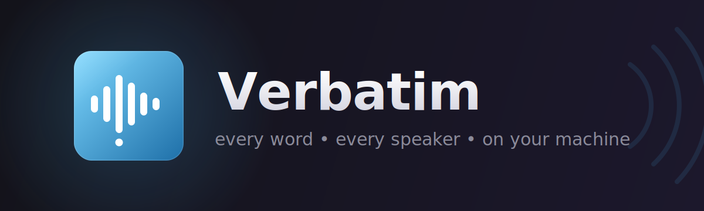
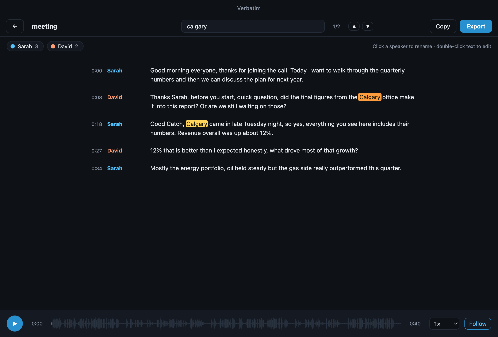
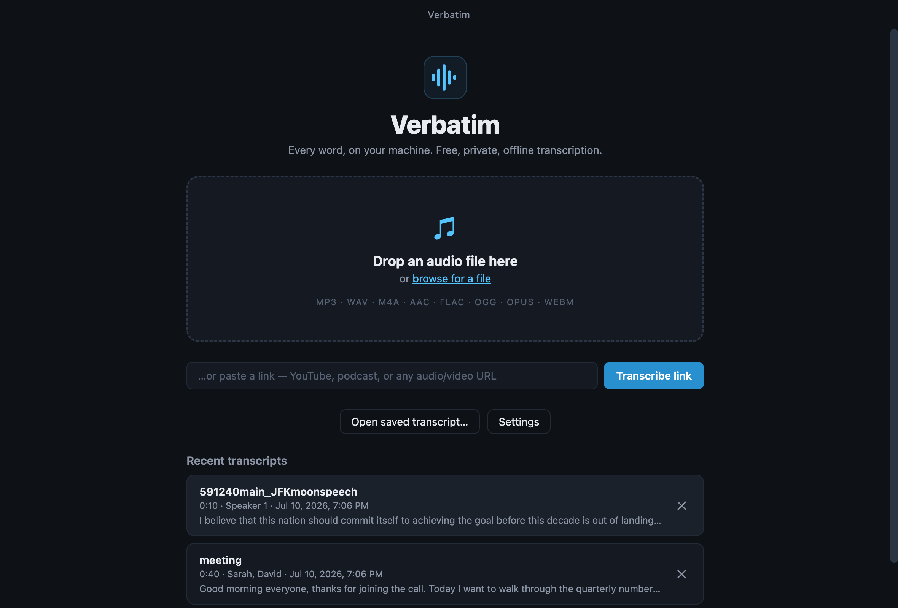

# Verbatim

**Every word, on your machine.** Free, private, offline audio transcription for
Windows and macOS — with automatic speaker identification.

Drop in an MP3, WAV, M4A, AAC, FLAC, OGG, OPUS, or WEBM recording — **or paste
a YouTube/podcast/any audio link** — and Verbatim gives you a searchable,
clickable transcript:

- **Speaker detection** — figures out who spoke when, and you can give each
  speaker a real name (applies across the whole transcript).
- **Click to jump** — click any line's timestamp to hear that exact moment;
  the transcript follows along while the audio plays.
- **Search** — find any word or phrase, hop between matches, jump the audio
  straight to them (`Cmd/Ctrl+F`).
- **Edit** — double-click any line to fix a mis-heard word; rename the
  transcript; everything auto-saves to your library.
- **Export** — TXT, SRT, VTT, or JSON, or copy the whole transcript.
- **Transcribe from a link** — paste a YouTube URL, podcast episode, or any
  direct audio/video link; Verbatim fetches the audio (via
  [yt-dlp](https://github.com/yt-dlp/yt-dlp), downloaded on first use) and
  transcribes it like any local file.
- **100% local transcription** — audio never leaves your computer. No account,
  no cloud, no fees. Network is used only for one-time model downloads and
  links you explicitly paste.




## How it works

Verbatim runs [OpenAI Whisper](https://github.com/openai/whisper) speech
recognition and [pyannote](https://github.com/pyannote/pyannote-audio) speaker
segmentation locally through
[sherpa-onnx](https://github.com/k2-fsa/sherpa-onnx). On first transcription it
downloads the speech models (~250 MB, one time); after that it is fully
offline.

Three model sizes are available in Settings: **Tiny** (fastest), **Base**
(recommended), and **Small** (most accurate). Around 30 languages are
supported, with automatic language detection.

## Install

- **macOS**: open the `.dmg` and drag Verbatim to Applications. The app is
  unsigned — on first launch, right-click the app and choose **Open**. (I am NOT paying for Apple Developer license)
- **Windows**: run the installer (Windows 10 1803 or later).

## Development

```bash
npm install
npm run icon      # regenerate build/icon.png
npm start         # run in development
npm run dist:mac  # build the macOS dmg
npm run dist:win  # build the Windows installer + zip
```

The sherpa-onnx executables live in `vendor/` (universal2 for macOS, x64 for
Windows) and are bundled into the installers as extra resources.

## License

MIT — part of The-Berin's free software line, alongside
[Photon](https://github.com/The-Berin/Photon) and
[ReType](https://github.com/The-Berin/ReType).
